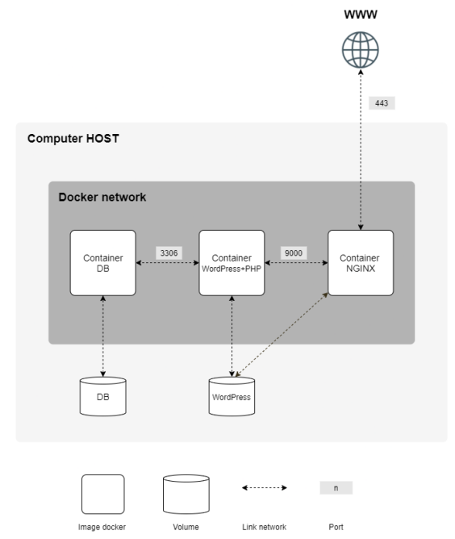

 

# Inception

This project is about setting up a wordpress website using a Docker container with NGINX and MariaDB.

The full subject can be found [here](.media/en.subject.pdf).

# Downloading and compiling the project

Clone the repository and use `make` to compile
```shell
git clone https://github.com/theozanchi/42_Berlin_inception/tree/main
cd 42_Berlin_inception
make
```
You need to have Docker installed in order for it to work

# Details about the project infrastructure
The project has to be set up within a virtual machine in order to have sudo rights (we do not have sudo rights on the school network).



Docker-compose is used to build the project. Each service has a dedicated container.
